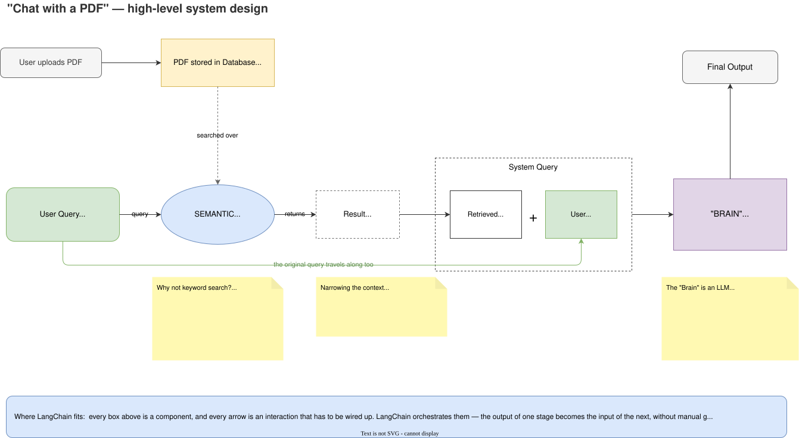

# LangChain — Overview: What It Is and Why It Exists

## 2. Why do we need LangChain? — the motivating example

### The idea (from around 2014)

Smartphones had just become common and people had started reading PDFs instead of physical books.
The idea: an application where anyone can **upload a PDF, read it, and *chat with it*.**

Example — upload a Machine Learning textbook, and then ask things like:

- "Explain page 5 as if I'm a 5-year-old" → get a simplified summary
- "Generate some true/false questions on the linear regression we just read" → get practice questions
- "Generate notes on the decision tree chapter" → get notes

Not just reading — **talking to your book.** Incredibly useful.

---

## 3. High-level system design


 
### Keyword search vs. semantic search

| | Keyword search | Semantic search |
| --- | --- | --- |
| How it works | Match the literal words — "assumptions", "linear regression" — anywhere in the book | Understand the *meaning* of the query and search for that |
| Result | Every page containing "assumptions" comes back — far too many, mostly irrelevant | Fewer pages, but the ones actually about *assumptions of linear regression* |
| Verdict | Inefficient | What we want |

### The "Brain" — what it must be able to do

Two capabilities, and only two:

1. **Natural Language Understanding (NLU)** — understand the query properly, whether asked in
   English or Hindi, so it knows what is being asked.
2. **Context-aware text generation** — read the pages it was handed, find the relevant answer, and
   generate the response.

### Why not just hand the Brain the whole book?

A fair question: if the Brain can understand a query and find answers in pages, why bother with
semantic search — just send all 1000 pages?

**The teacher analogy:** you have a doubt in your maths book.

- *Scenario 1:* hand your teacher the whole book and say "I have a doubt in algebra."
- *Scenario 2:* say "Sir, I have a doubt on page 155."

Obviously scenario 2 gets a faster and better answer. Same here — sending the whole book is
**computationally more expensive** and gives **worse results**. That's the entire justification for
the semantic search step.

---

## 4. How semantic search actually works

Suppose you have three paragraphs about three cricketers — Virat Kohli, Jasprit Bumrah, Rohit
Sharma — and the question *"How many runs has Virat scored?"* You know the answer is in the Kohli
paragraph, but how does the code know?

**The mechanism:**

1. Convert every paragraph into an **embedding** — a vector, i.e. a set of numbers that represents
   the paragraph's semantic meaning. (Techniques: Word2Vec, Doc2Vec, BERT embeddings, and others.)
   Say each vector has 100 dimensions.
2. When the query arrives, generate its embedding too — also 100 dimensions.
3. You now have 4 vectors in the same 100-dimensional space: 3 paragraphs + 1 query.
4. Compute the **similarity** of the query vector against each paragraph vector.
5. The strongest similarity tells you which paragraph the question relates to — use that paragraph
   to answer.

---

## 5. Low-level system design

```
  User uploads PDF
        │
        ▼
  ┌──────────────┐
  │  AWS S3      │   store the PDF in the cloud
  └──────┬───────┘
         ▼
  ┌──────────────┐
  │ DOCUMENT     │   bring the PDF into the system
  │ LOADER       │
  └──────┬───────┘
         ▼
  ┌──────────────┐
  │ TEXT         │   split into small chunks — by chapter,
  │ SPLITTER     │   page, or paragraph. 1000 pages → 1000 chunks
  └──────┬───────┘
         ▼
  ┌──────────────┐
  │ EMBEDDING    │   each page → one vector in n-dimensional space
  │ MODEL        │   → 1000 vectors
  └──────┬───────┘
         ▼
  ┌──────────────┐
  │ DATABASE     │   store the embeddings so you can query them later
  └──────┬───────┘
         │
         │      ┌─────────────────────────────────────────┐
         │      │ User query ──▶ SAME embedding model ──▶  │
         │      │ query vector (n-dimensional)             │
         │      └──────────────────┬──────────────────────┘
         ▼                         ▼
  ┌──────────────────────────────────────┐
  │ Compare query vector against all      │  compute distances,
  │ 1000 stored vectors                   │  return the top-k (say 5)
  └──────────────────┬───────────────────┘  most similar
                     ▼
        extract the corresponding pages
                     │
                     ▼
      original query + retrieved pages = SYSTEM QUERY
                     │
                     ▼
              ┌─────────────┐
              │    BRAIN    │  NLU + context-aware text generation
              └──────┬──────┘
                     ▼
              Final output to user
```

---

## 6. The three big challenges in building this

### Challenge 1 — Building the "Brain"

You need a component that can (a) fully understand any query sent to it, and (b) generate relevant
text from it. Both are individually very hard problems.

A lot of NLP work went into these, but the breakthrough came in **2017 with the Transformers
paper**, then BERT and GPT, and then the whole LLM era — at which point the problem was finally
cracked.

**Resolution:** you don't have to build this. LLMs already on the market have both capabilities.
Replace "Brain" in the diagram with **LLM**. You can use an open-source LLM, or if you're a very
large company, train your own foundation model. What was a huge challenge in 2015 is trivially
solvable today.

### Challenge 2 — Computation and cost

If you want to use an LLM as your Brain, you have to host it somewhere — on your own server. LLMs
are enormous deep learning models trained on internet-scale data. Running one on your servers for
inference means:

- Serious engineering work
- Serious computational problems to solve
- Very high cost

**Resolution:** big companies (OpenAI, Anthropic, Google, and others) put their models on *their*
servers and wrapped an **API** around them. You send a question, it reaches their LLM, the reply
comes back to your user. You don't host anything. And you **pay only for what you use** — low usage,
low payment.

So the diagram's "LLM" becomes **LLM API**.

> Summary: NLU + text generation were solved by **LLMs**. The computational challenges around LLMs
> were solved by **APIs**. Both of the first two challenges are already solved as of 2025.

### Challenge 3 — Orchestration (this is the one LangChain solves)

Making all these components work *together* is itself a large challenge.

**Five components in this system:**

1. AWS S3 — document storage
2. Text splitter — a model that decides how splitting happens based on the document
3. Embedding model
4. Database — for storing embeddings
5. LLM

**Six tasks to execute as a pipeline:**

1. Load the document
2. Split the text
3. Generate embeddings
4. Manage the database
5. Retrieve
6. Talk to the LLM

Writing all of this from scratch would be very difficult. And then things change:

- Tomorrow OpenAI's API is too costly and you want to switch providers
- You move from AWS to GCP
- You want a different embedding model

So many moving parts, so much interaction between them, and a very complex pipeline — hand-coding
all of it is a very challenging task.

**And this is where LangChain comes into the picture.** It gives you built-in functionality so all
these components interact in a plug-and-play way, and swapping one out is a small change instead of
a rewrite. All the boilerplate is handled behind the scenes.

> **The summary of the whole argument:** in an LLM-powered application, the LLM does a lot of the
> heavy lifting — but running that application end-to-end with all its moving components is very
> difficult, especially while the technology is this new. LangChain says: *you focus on your idea;
> I'll handle the interfacing and orchestration.*

---

## 7. Formal benefits of LangChain

1. **Chains** — this is where the name comes from. You can give different components and tasks the
   form of a chain (a pipeline). The best feature: **one component's output automatically becomes
   the next component's input** — no manual wiring. You can build complex chains, **parallel
   chains**, and **conditional chains**, so however complex your pipeline is, chains can express it.

2. **Model-agnostic development** — use OpenAI, Google, or anything else; it doesn't matter. Your
   whole codebase shifts to a different component in a line or two of code. Focus on your core
   business logic; move components around freely.

3. **Complete ecosystem** — every component type comes in many varieties: document loaders (cloud,
   Excel, PDF, anything), a large number of text splitters, many embedding models, many databases.
   Whatever component your company wants to work with, an interface exists in LangChain. You'll
   never hit "we can't implement this component in LangChain."

4. **Memory and state handling** — example: the user asks *"What are the assumptions of linear
   regression?"*, gets an answer, and immediately asks *"Also give me a few interview questions on
   this ML algorithm."* Which algorithm? Without memory, the system has no idea the previous query
   was about linear regression. LangChain's conversation-memory concept solves this — the model
   understands the topic without it being mentioned again.

---

## 8. What can you build with LangChain?

1. **Conversational chatbots**
   The most popular use case. Internet-based companies (Uber, Swiggy, etc.) face a **scale** problem
   — dealing with very many customers at once. Setting up a call centre and hiring lots of people is
   a big challenge. A chatbot that talks like a call-centre executive, understands the query and
   provides a solution, solves a big business problem. In practice the chatbot handles the **first
   layer** of communication and forwards what it can't handle to a human.

2. **AI knowledge assistants**
   Essentially a chatbot that also has access to *your* data. Example: a chatbot embedded in a
   course website so that while a student watches a lecture, they can immediately ask about a doubt
   — and the bot knows what's inside that lecture.

3. **AI agents**
   *"Chatbots on steroids"* — they don't just talk, they *do*. Example: on a travel-booking site,
   older users may not be fluent with booking flows. An AI agent can be given tools so that a senior
   citizen simply says "book me the cheapest flight from A to B on this date" and the agent executes
   the whole task itself. Widely considered the next big thing in AI. (A basic agent gets built
   later in this playlist.)

4. **Workflow automation** — personal, professional, or company-level.

5. **Summarization and research helpers**
   Two real constraints motivate this: you can't upload very large books to a hosted chat tool
   (context-length limits), and many companies forbid uploading private data to third-party tools.
   So a company can use LangChain to build its own ChatGPT-like tool that processes arbitrarily
   large documents and can be given private company data.

> The outlook: just as there was a boom in websites and then in apps, an **LLM-based application
> boom** looks likely — and LangChain will play a key role in it.

---

## 9. Alternatives to LangChain

LangChain is not the only framework for building LLM applications. Two well-known alternatives:

- **LlamaIndex** — quite popular, widely used
- **Haystack** — a similar kind of platform / library / framework

Plenty of companies use these instead of LangChain. The choice depends on pricing and which tool
fits you best. A proper comparative analysis (pros and cons of LangChain vs. LlamaIndex vs.
Haystack) is deferred — it isn't the right time before studying LangChain itself properly. For now,
just know that alternatives exist.

---

## 10. What's next

The next video covers **LangChain's complete ecosystem / components**. After that the playlist jumps
into the practical part — writing code and building LLM-based applications.

---

## Key takeaways

1. **Learn *why* before *what*** — LangChain only makes sense once you've felt the orchestration
   pain it removes.
2. **The "Brain" is just an LLM API now.** The two hardest parts of the 2014 idea — language
   understanding and context-aware generation, plus the cost of hosting a model — were solved by
   LLMs and by provider APIs respectively.
3. **Semantic search exists to narrow the context**, not because the LLM can't read. Fewer, more
   relevant pages = cheaper and better answers. (Page 155, not the whole book.)
4. **Embeddings are the mechanism:** text → vectors → similarity comparison → top-k matches.
5. **LangChain's real value is orchestration** — chains, model-agnosticism, a complete component
   ecosystem, and memory.
