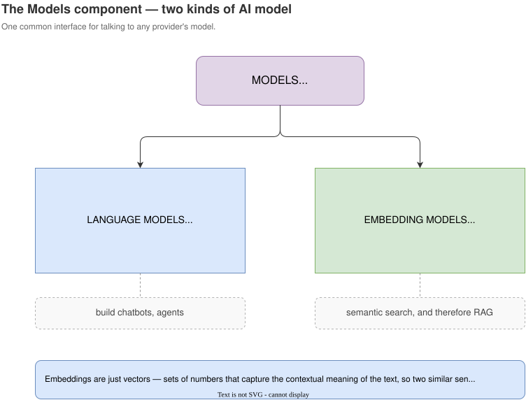
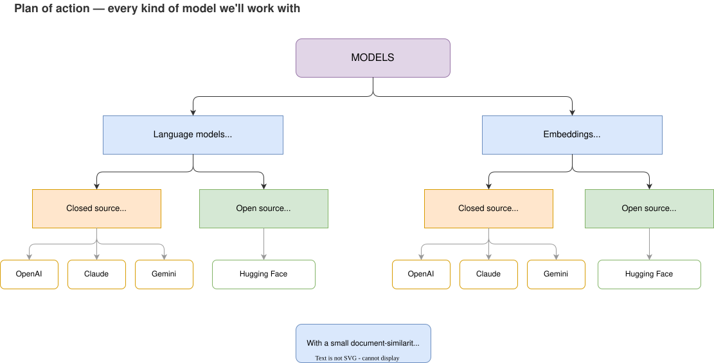
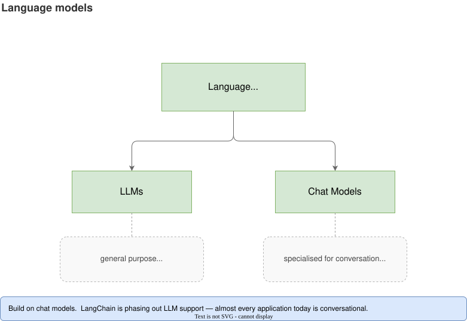

# LangChain — The Models Component (in depth)

## 1. What the Models component is

> The Model component in LangChain is a crucial part of the framework, designed to facilitate
> interactions with various language models and embedding models.

In plain terms: many different AI models exist in the world, and each company's API behaves
differently. The Models component gives you **one common interface** to connect to any of them.

| | Language models | Embedding models |
| --- | --- | --- |
| Input | Text — "What is the capital of India?" | Text — "What is the capital of India?" | 
| Output | Text — "New Delhi" | A series of numbers (a vector) |
| The output is called | a completion / reply | an **embedding** |
| What it's for | Chatbots and similar apps | **Semantic search**, and therefore RAG |



Embeddings are just vectors — sets of numbers that capture the *contextual meaning* of the text.

---

## 2. Plan of action

The rest of this note is code. Here's the ground it covers — every kind of model, in a fixed order.



**Part 1 — language models.** Closed-source first (OpenAI's GPT, Anthropic's Claude, Google's
Gemini), then open-source via Hugging Face, both through the inference API and downloaded to run
locally.

**Part 2 — embedding models.** The same split: a closed-source embedding model, then an
open-source one downloaded from Hugging Face.

**Finally**, a small document-similarity application that puts embeddings to work — the seed of
every RAG app later in the playlist.

| | Closed source — paid, via API | Open source — free |
| --- | --- | --- |
| **Language models** | OpenAI, Claude, Gemini | Hugging Face (API + local) |
| **Embedding models** | OpenAI | Hugging Face (local) |

The reason for covering both columns: closed-source models are what most companies actually use in production, so they're worth practising against — but they cost money, and open-source models are the free route as well as the only option when your data can't leave your machine.

---

## 3. Language models split again: LLMs vs. Chat models

This distinction matters, and it decides which class you import.



**LLMs** are general-purpose models: text generation, summarisation, code generation, question
answering — anything. You give them a **plain string**, you get back a **plain string**.

**Chat models** are language models specialised for conversation. They take a **sequence of
messages** as input and return **chat messages** as output.

| | **LLMs** | **Chat models** |
| --- | --- | --- |
| Purpose | Free-form text generation | Multi-turn conversation between user and AI |
| Training | General text — books, articles, Wikipedia | The same, then **fine-tuned on chat datasets** |
| Memory | No memory concept | Supports conversation history |
| Role awareness | None — you can't assign roles | Yes — system / user / assistant roles |
| Use when | Summarisation, translation, code generation | Chatbots, virtual assistants, customer support, AI tutors, agents |

### The important practical point

**LLMs are effectively deprecated.** Support for them is being phased out in LangChain, and recent
versions tell you not to build new projects on them. Nearly every AI application being built today
is conversational, so the whole industry has shifted to chat models.

This note covers LLMs first (briefly, so the difference is concrete), then spends the rest of its
time on chat models — which is what you should actually use.

---

## 4. Setup

1. make a project folder and open it in your editor
2. create and activate a virtual environment
   ```bash
   python -m venv venv
   ```
3. Activate the venv.
   ```bash
   venv\Scripts\Activate        # Windows
   source venv/bin/activate     # macOS / Linux
   ```
4. Create a new venv.
   ```bash
   python -m venv venv
   ```
5. Create the `requirements.txt` — the package list for this project.
6. Install the packages from it.
   ```bash
   pip install -r requirements.txt
   ```
7. Verify the LangChain installation.

   Verify LangChain landed:
   ```python
   import langchain
   print(langchain.__version__)
   ```

Then create three folders to keep the demos apart:

```
project/
├── venv/
├── .env                 ← API keys live here, never in code
├── requirements.txt
├── llms/
├── chat_models/
└── embedding_models/
```

### API keys and the `.env` file

Keys go in a `.env` file, never inline in your code:

```bash
OPENAI_API_KEY="..."
ANTHROPIC_API_KEY="..."
GOOGLE_API_KEY="..."
HUGGINGFACEHUB_API_TOKEN="..."
```

**The variable names are not free choice** — each integration looks for a specific name. If you
rename them, `load_dotenv()` will load the file fine but the library won't find its key and your
code fails.

> ⚠️ The video writes the Hugging Face variable as `HUGGINGFACEHUB_ACCESS_TOKEN`. The
> `langchain-huggingface` package actually looks for **`HUGGINGFACEHUB_API_TOKEN`**. If you hit an
> auth error there, this is why. Check the current provider docs when in doubt.

**Where to get the keys:**

| Provider | Key page |
| --- | --- |
| Anthropic (Claude) | <https://platform.claude.com/settings/keys> |
| OpenAI | <https://platform.openai.com/api-keys> |

Create the key, copy it once (neither console shows it again), and paste it straight into `.env`.

Both OpenAI and Anthropic now require **paid credits** before they issue usable API keys — roughly
$5 is more than enough for a playlist's worth of experimenting. Free credits for new accounts are
largely gone. Hugging Face is the free route, and is covered later in this note.

Add `.env` to `.gitignore`. A key committed to a public repo is a key that gets scraped.

---

## 5. LLMs — the old interface

```python
from langchain_openai import OpenAI
from dotenv import load_dotenv

load_dotenv()

llm = OpenAI(model="gpt-3.5-turbo-instruct")

result = llm.invoke("What is the capital of India?")
print(result)
# The capital of India is New Delhi.
```

Note the shape:

- `langchain_openai` is the **integration package** — it contains the code that knows how to talk
  to OpenAI's API.
- `load_dotenv()` pulls your key out of `.env` into the environment.
- **`invoke()` is the single most important method in LangChain.** Models, prompts, chains,
  retrievers — every core component has it. (The machinery behind it, the *Runnable* interface,
  comes later in the playlist.)
- A **string goes in, a string comes out.** That's what makes this an LLM.

---

## 6. Chat models

### OpenAI

```python
from langchain_openai import ChatOpenAI
from dotenv import load_dotenv

load_dotenv()

model = ChatOpenAI(model="gpt-4")

result = model.invoke("What is the capital of India?")
print(result)          # the full message object + metadata
print(result.content)  # just the answer
```

Two things changed: `OpenAI` → `ChatOpenAI`, and the result is no longer a bare string.

Printing `result` gives you a message object carrying **metadata** — completion tokens, prompt
tokens, total tokens, and more. When you only want the answer, read `result.content`.

### What's different under the hood

Follow the classes back through their inheritance and the distinction is exact:

| Class | Inherits from |
| --- | --- |
| `OpenAI` | `BaseLLM` |
| `ChatOpenAI` | `BaseChatModel` |

Every LLM integration inherits `BaseLLM`; every chat model inherits `BaseChatModel`. That is the
real dividing line in LangChain. (Nice to know, not essential.)

### Anthropic (Claude)

```python
from langchain_anthropic import ChatAnthropic
from dotenv import load_dotenv

load_dotenv()

model = ChatAnthropic(model="claude-3-5-sonnet-20241022")

result = model.invoke("What is the capital of India?")
print(result.content)
```

### Google (Gemini)

```python
from langchain_google_genai import ChatGoogleGenerativeAI
from dotenv import load_dotenv

load_dotenv()

model = ChatGoogleGenerativeAI(model="gemini-1.5-pro")

result = model.invoke("What is the capital of India?")
print(result.content)
```

**This is the whole point of the Models component.** Three different companies, three different
APIs underneath — and the code is structurally identical. Change the import, change the model name,
and you've switched providers.

> Model IDs change often. Check the provider's own model page for what's current rather than
> copying an ID from a video or a note — including this one.

---

## 7. Two parameters worth knowing

### `temperature` — the creativity dial

Controls the randomness of the output: how creative versus how deterministic the responses are.
Range is roughly 0 to 2.

> **Clarification (added in video 4).** The precise property is *reproducibility for the same
> input*: at `temperature=0` the same prompt returns **exactly the same output on every run**; as
> you raise it, repeated runs of an identical prompt diverge. See
> [06-langchain-prompts.md](06-langchain-prompts.md) §0.5.

| Use case | Suggested temperature |
| --- | --- |
| Factual answers, maths, code | 0.0 – 0.3 |
| General QA, explanation | 0.5 – 0.7 |
| Creative writing, storytelling, jokes | 0.9 – 1.2 |
| Maximum randomness, brainstorming | 1.5+ |

```python
model = ChatOpenAI(model="gpt-4", temperature=1.5)
```

Honest observation from the video: on short factual prompts the difference is hard to see. Try it
on something generative — "write a five-line poem about cricket" — where the variation is obvious.

### `max_completion_tokens` — the cost cap

Limits how many tokens come back.

```python
model = ChatOpenAI(model="gpt-4", temperature=1.5, max_completion_tokens=10)
```

Why it matters: paid APIs bill **per token**, priced per million tokens. Capping output caps spend.

Treat tokens as *roughly* words for now — they aren't exactly words, and tokenization is a whole
topic of its own.

---

## 8. Open-source models

> Open-source models are freely available AI models that can be downloaded, modified, fine-tuned
> and deployed without restrictions from a central provider.

Everything so far was **closed-source**: the model sits on the provider's servers and you reach it
through an API. Two flaws follow from that — you pay per call, and you have no control over the
model.

| | **Open-source** | **Closed-source** |
| --- | --- | --- |
| Cost | Free — run it locally, no API | Pay per API call |
| Control | Full — fine-tune, modify, deploy anywhere | None — you use the provider's infrastructure |
| Data privacy | Data never leaves your machine | Your data goes to their servers |
| Customisation | Fine-tune on your own datasets | Limited, and only some providers offer it |
| Deployment | Your servers or your cloud | Not possible |

The privacy point is the one that decides real projects: **you cannot send confidential company
documents to a third-party API**, but you can run an open-source model against them locally.

**Well-known open-source models:** Llama (Meta) is the most famous, plus Mistral, Falcon, and
domain-specific ones like BLOOM.

**Where to find them: Hugging Face** — the largest repository of open-source models, with thousands
hosted across multimodal, computer-vision and NLP tasks. For this note, the relevant category is
*text generation*.

### Two ways to use them

**a) Through the Hugging Face Inference API** — the model stays on Hugging Face's servers:

```python
from langchain_huggingface import ChatHuggingFace, HuggingFaceEndpoint
from dotenv import load_dotenv

load_dotenv()

llm = HuggingFaceEndpoint(
    repo_id="TinyLlama/TinyLlama-1.1B-Chat-v1.0",
    task="text-generation",
)
model = ChatHuggingFace(llm=llm)

result = model.invoke("What is the capital of India?")
print(result.content)
```

Free up to a limit, then paid — but that limit is generous for students and small projects, and one
key gives you access to thousands of models.

**b) Downloaded and run locally** — note `HuggingFacePipeline` instead of `HuggingFaceEndpoint`:

```python
from langchain_huggingface import ChatHuggingFace, HuggingFacePipeline

llm = HuggingFacePipeline.from_model_id(
    model_id="TinyLlama/TinyLlama-1.1B-Chat-v1.0",
    task="text-generation",
    pipeline_kwargs={"temperature": 0.5, "max_new_tokens": 100},
)
model = ChatHuggingFace(llm=llm)

result = model.invoke("What is the capital of India?")
print(result.content)
```

On the first run the model weights, tokenizer and config files download to your machine (a few
hundred MB for TinyLlama) and load into RAM. Later runs use the cache, so nothing downloads again.

To move the download location off your system drive:

```python
import os
os.environ["HF_HOME"] = "D:/huggingface_cache"
```

### The honest caveats

- **Hardware.** On an 8 GB-RAM machine with no GPU, even this small 1.1B-parameter model took
  around **10 minutes** and made the machine unusable — a restart was needed. Bigger models need
  expensive GPUs most individuals don't own.
- **Setup complexity.** Getting the environment right is fiddly compared to calling an API.
- **Less refinement.** Open-source models generally receive less RLHF (reinforcement learning from
  human feedback), so answers feel rougher than GPT or Claude. Fine-tuning is your lever here.
- **Limited multimodal ability** — mostly text-only today.

---

## 9. Embedding models

Same interface, different output: text in, **vector out**.

### OpenAI — a single query

```python
from langchain_openai import OpenAIEmbeddings
from dotenv import load_dotenv

load_dotenv()

embedding = OpenAIEmbeddings(model="text-embedding-3-large", dimensions=32)

result = embedding.embed_query("Delhi is the capital of India")
print(str(result))
```

`dimensions` sets the vector length. Bigger vector = more context captured; smaller vector =
cheaper. The defaults are large — 1536 for the small model, 3072 for the large one.

### OpenAI — multiple documents

```python
documents = [
    "Delhi is the capital of India",
    "Kolkata is the capital of West Bengal",
    "Paris is the capital of France",
]

result = embedding.embed_documents(documents)
```

`embed_query` takes one string; **`embed_documents` takes a list** and returns a list of vectors —
a 2-D list, one row per document.

### Hugging Face — locally

```python
from langchain_huggingface import HuggingFaceEmbeddings

embedding = HuggingFaceEmbeddings(model_name="sentence-transformers/all-MiniLM-L6-v2")

text = "Delhi is the capital of India"
vector = embedding.embed_query(text)
print(str(vector))
```

`all-MiniLM-L6-v2` maps sentences and paragraphs to a **384-dimensional** dense vector space, and is
built for clustering and semantic search. At ~90 MB it's small enough that downloading beats using
the API. `embed_documents` works here too.

### On cost

Embeddings are **cheap** — on the order of a few cents per million tokens, because the output is
just numbers. Given that, paid embeddings are usually worth it: they generally capture context
better than the free local models, which in practice are somewhat less accurate.

---

## 10. Mini-project: document similarity search

The payoff — a working semantic search in about 30 lines.

**The idea:** five documents, one user question. Which document answers it?

```
   5 documents ──embed──▶ 5 vectors (300-dim)  ┐
                                               ├──▶ cosine similarity
   user query ──embed──▶ 1 vector (300-dim)    ┘         │
                                                          ▼
                                            highest score = the answer
```

Embed everything into the same space, then measure the **angle** between the query vector and each
document vector. Highest cosine similarity wins.

```python
from langchain_openai import OpenAIEmbeddings
from sklearn.metrics.pairwise import cosine_similarity
from dotenv import load_dotenv
import numpy as np

load_dotenv()

embedding = OpenAIEmbeddings(model="text-embedding-3-large", dimensions=300)

documents = [
    "Virat Kohli is an Indian cricketer known for his aggressive batting and leadership.",
    "MS Dhoni is a former Indian captain famous for his calm demeanor and finishing skills.",
    "Sachin Tendulkar, also known as the 'God of Cricket', holds many batting records.",
    "Rohit Sharma is known for his elegant batting and record-breaking double centuries.",
    "Jasprit Bumrah is an Indian fast bowler known for his unorthodox action and yorkers.",
]

query = "tell me about Virat Kohli"

doc_embeddings = embedding.embed_documents(documents)
query_embedding = embedding.embed_query(query)

scores = cosine_similarity([query_embedding], doc_embeddings)[0]

index, score = sorted(list(enumerate(scores)), key=lambda x: x[1])[-1]

print(query)
print(documents[index])
print("similarity score is:", score)
```

**The `enumerate` trick is the part worth remembering.** Sorting the scores alone would destroy the
link between a score and its document. Wrapping them with `enumerate` pairs each score with its
index first, so after sorting by score (`key=lambda x: x[1]`) you still know which document it came
from. Take `[-1]` for the highest.

Ask about Bumrah instead and it returns the Bumrah document. That is semantic search working.

### What's missing — and where this goes next

The embeddings are regenerated **every single run**, which is a costly operation repeated for no
reason. The fix is to generate the document embeddings once and store them — in a **vector
database**. Then at query time you embed only the new query and search the stored vectors. That
lookup step is called **retrieval**, and both pieces are the foundation of RAG applications later
in the playlist.

---

## 11. What's next

The planned chatbot application was deferred: **prompts** need covering first. That's the next
video, after which the chatbot becomes straightforward.

---

## Key takeaways

1. **Two model families, one interface.** Language models (text → text) and embedding models
   (text → vector), both reached through the same `invoke`-shaped API.
2. **Use chat models, not LLMs.** LLMs are general-purpose and stateless with no role awareness;
   chat models are fine-tuned on conversation, support history and roles, and are what LangChain
   now steers you towards. LLM support is being phased out.
3. **`invoke()` is everywhere** — models, prompts, chains, retrievers. Learn it once.
4. **Chat model results are objects, not strings.** Use `result.content` for the answer; the rest
   is metadata, including token counts.
5. **Switching providers is a two-line change** — the import and the model name. That is the entire
   value proposition of the Models component, and it holds across OpenAI, Anthropic, Google and
   Hugging Face.
6. **Env var names are fixed by the integration**, not by you. Getting one wrong is a silent auth
   failure.
7. **Open source buys privacy and control; closed source buys quality and convenience.** The
   deciding factor in real projects is usually whether your data may leave the building.
8. **Running models locally is hardware-bound.** A 1.1B-parameter model brought an 8 GB machine to
   its knees — plan for a GPU, or use an inference API.
9. **`embed_query` for one string, `embed_documents` for a list.** Bigger `dimensions` captures
   more context and costs more; embeddings are cheap enough that this rarely matters.
10. **Semantic search is just cosine similarity between embeddings** — and once you store those
    vectors in a database instead of recomputing them, you have the skeleton of RAG.
